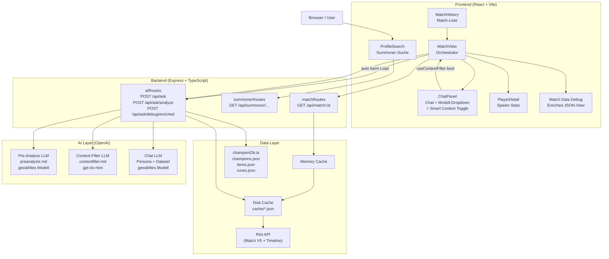
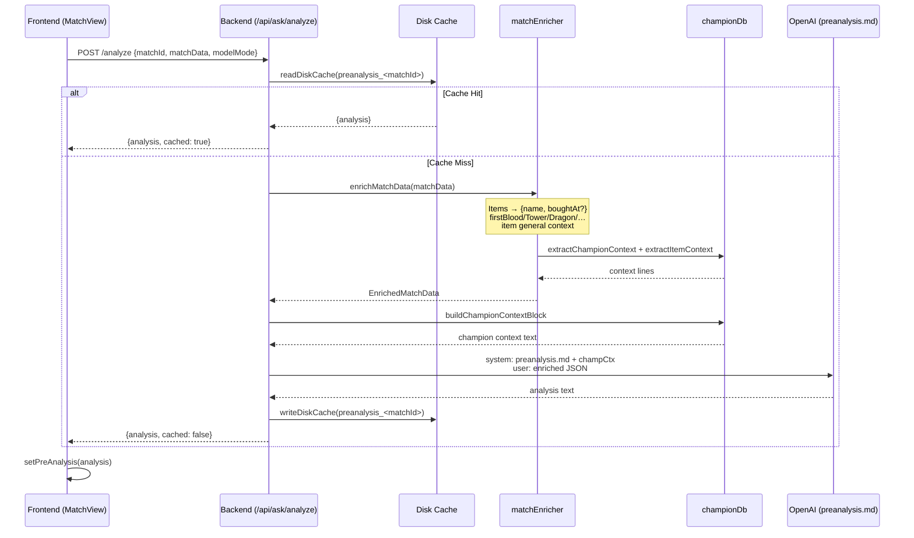
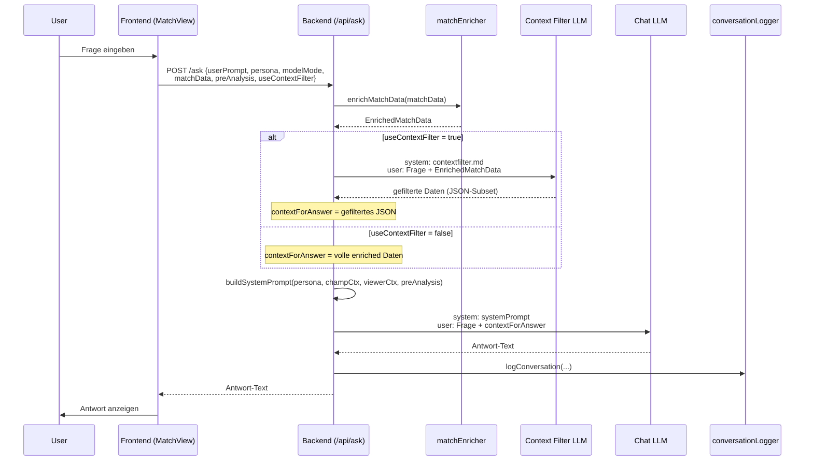
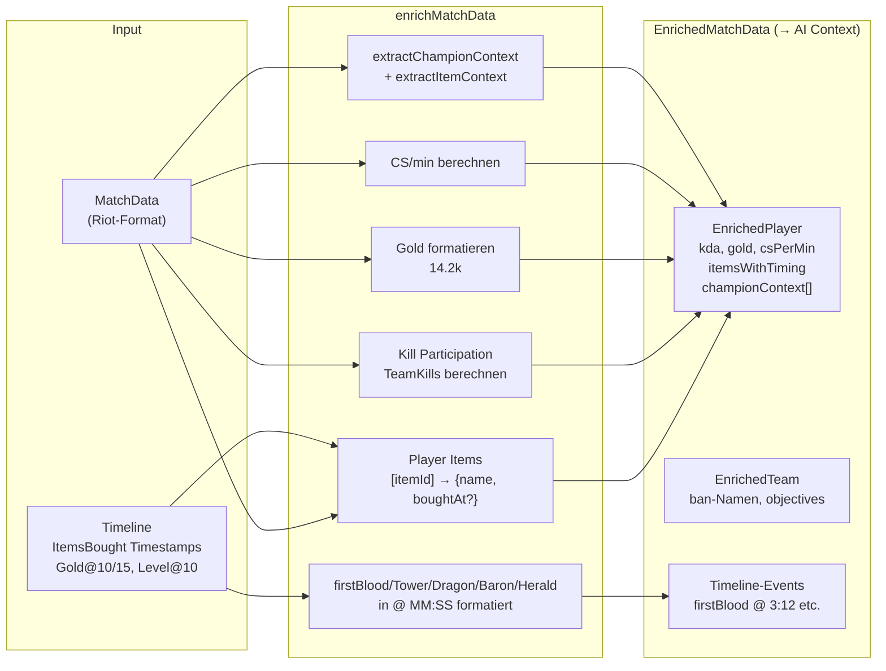
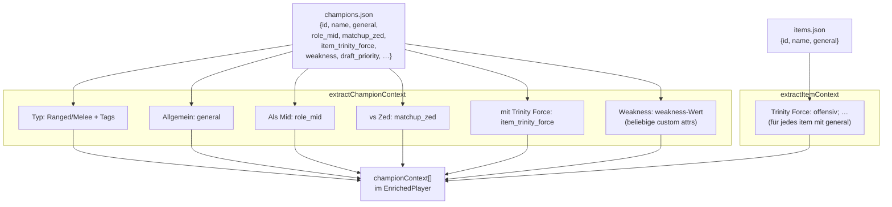

# Architektur — LoL Match Analyst

## System-Überblick



## Pre-Analyse Pipeline

Startet automatisch wenn ein Match geladen wird. Ergebnis gecacht.



## Chat Pipeline (mit Context Filter)



## Daten-Anreicherung (matchEnricher)



## Champion-Kontext-Injection



## Caching-Strategie

```
GET /api/match/:matchId
         │
         ▼
  MemoryCache (Map)  ─── HIT ──→ return
         │ MISS
         ▼
  DiskCache (cache/*.json)  ─── HIT ──→ populate MemCache → return
         │ MISS
         ▼
  Riot API (match + timeline parallel)
         │
  matchMapper.ts → MatchData
  timelineProcessor.ts → TimelineInsights
         │
  → populate DiskCache + MemCache → return

POST /api/ask/analyze
         │
         ▼
  DiskCache (cache/preanalysis_<matchId>.json)  ─── HIT ──→ return
         │ MISS
         ▼
  enrichMatchData() → LLM → writeDiskCache → return
```

## Frontend-Komponenten

```
App
├── ProfileSearch          Summoner-Suche (gameName + tagLine → puuid)
└── MatchHistory           Match-Liste für einen Summoner
    └── MatchView           Haupt-Ansicht für ein Match
        ├── LoadingScreen   Match-Übersicht (Spieler-Raster)
        ├── PlayerDetail    Statistik-Overlay für einen Spieler
        ├── ChatPanel       Chat-Interface
        │   ├── Persona-Dropdown
        │   ├── Modell-Dropdown
        │   └── Smart Context Toggle (useContextFilter)
        └── Debug-Overlay   Raw EnrichedMatchData (Match Data Button)
```
